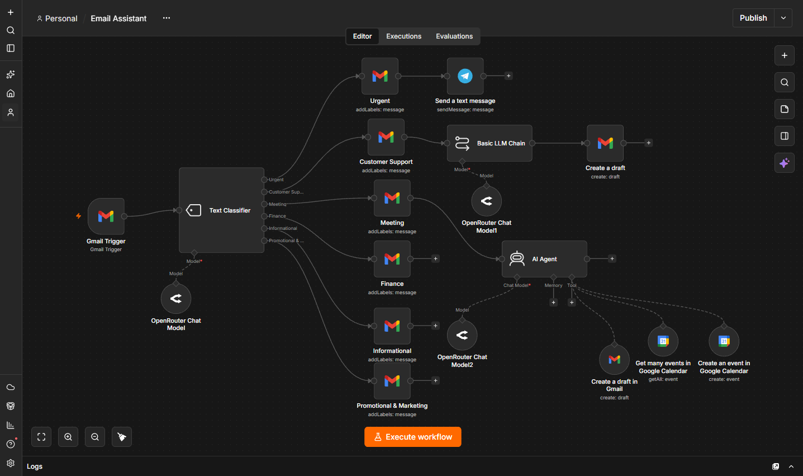

# 🤖 AI Email Assistant — n8n

My first n8n workflow: an AI-powered email assistant that classifies incoming Gmail messages and automatically performs different actions based on the type of email.

## ✨ What does it do?

The workflow monitors incoming Gmail messages and uses AI to classify them into six categories:

* 🚨 Urgent
* 💬 Customer Support
* 📅 Meeting
* 💰 Finance
* ℹ️ Informational
* 📣 Promotional & Marketing

Depending on the category, the workflow performs a different action.

### Workflow

```text
Gmail
  ↓
AI Email Classification
  ↓
 ┌───────────────┬──────────────────┬───────────────┐
 ↓               ↓                  ↓
Urgent       Customer Support      Meeting
 ↓               ↓                  ↓
Telegram     AI Response Draft   Calendar Check
Notification      ↓                  ↓
              Gmail Draft       Create Event /
                                Suggest Alternative
```

## 🛠️ Technologies

* n8n
* Gmail
* Google Calendar
* Telegram
* OpenRouter
* LLM / AI Agent

## 🚀 Features

* **Email Classification** — AI categorizes emails into six categories: Urgent, Customer Support, Meeting, Finance, Informational, and Promotional & Marketing.
* **Urgent Notifications** — Sends Telegram alerts for urgent emails.
* **Customer Support** — Generates Gmail draft replies for review before sending.
* **Meeting Assistant** — Extracts meeting details, checks Google Calendar availability, and creates events or suggests alternative times when conflicts occur.


## ⚙️Setup
* Import email-assistant.json into n8n.
* Connect your accounts and credentials.
* Review the workflow settings.
* Test it and activate the workflow.

Note: AI-generated email replies are saved as drafts so they can be reviewed before being sent.

## 📸 Workflow Preview

